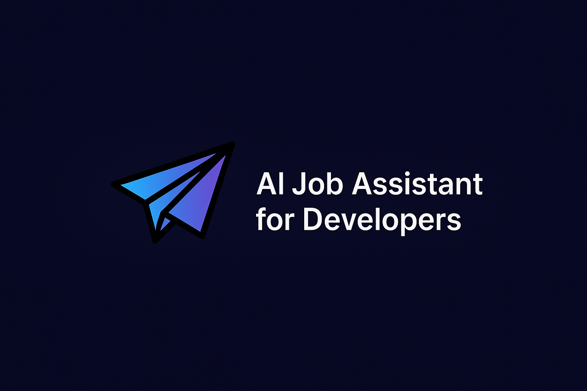

# 🚀 DevAssist

**AI-Powered Job Assistant for Developers**  
DevAssist helps developers generate tailored cover letters and emails, track applications, manage profiles, and apply faster — all in one place.



---

## ✨ Features

- 🔍 **Paste Job Descriptions** – Let AI generate tailored cover letters & emails
- 🎯 **Smart Tech Stack Detection** – Matches job descriptions to your skills
- 🧠 **Profile Manager** – Save reusable profiles with resumes and stack info
- 📨 **Direct Email Sending** – Apply directly to hiring managers from the app
- 📊 **Application Tracker** – Track status and manage your job search
- 🧾 **Export Options** – Save to PDF, Google Docs, or Notion
- 💬 **Tone & Format Control** – Rephrase with different tones or templates
- 💡 **Credit System** – Use points for generation, upgrade for more power
- 🌗 **Dark Mode** – Clean and accessible UI in both light and dark themes

---

## 🌐 Live Site

👉 [Visit DevAssist]

---

## ⚙️ Tech Stack

- **Frontend**: React + Vite + TypeScript
- **Styling**: Tailwind CSS + Shadcn UI
- **State**: Zustand
- **Auth & Storage**: Firebase
- **Email Sending**: EmailJS
- **AI Integration**: OpenAI (planned)
- **Deployment**: Vercel

---

## 📦 Getting Started

```bash
git clone git@github.com:Muhammadalamin029/dev-assist-apply-ai.git
cd devassist
npm install
npm run dev
```
